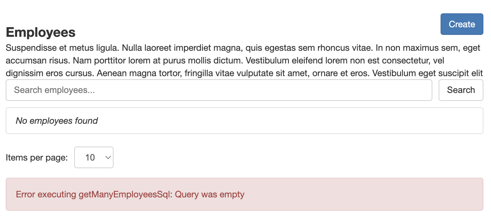
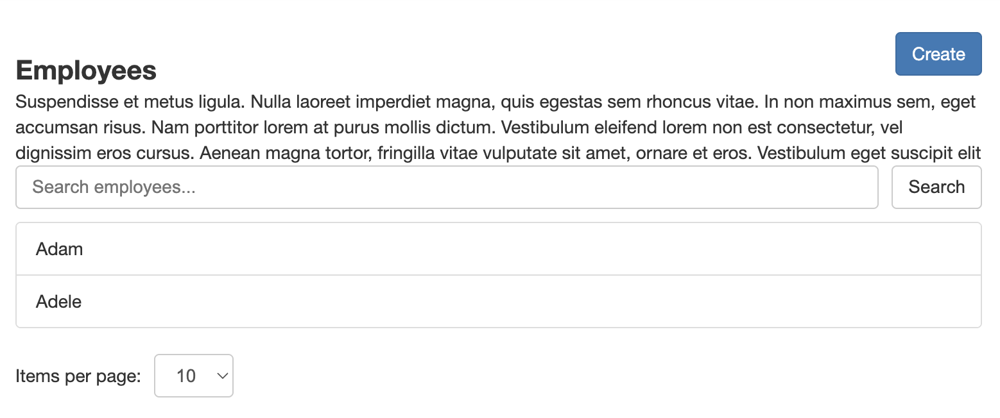
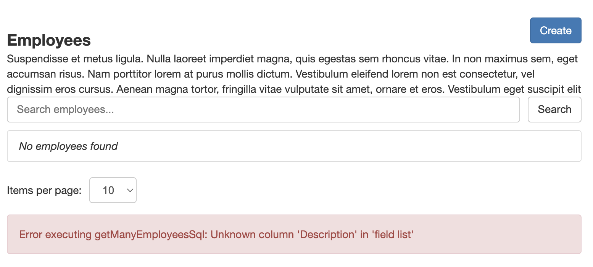

# Skills Matrix SQL

Skills matrix application with a React frontend, a NestJS web API and a MySQL database.

## Setup

- Install [Docker Desktop](https://www.docker.com/products/docker-desktop/)
- Install [node.js](https://nodejs.org/en/download/current)
- Download [this repository](https://github.com/capelski/skills-matrix-sql.git) either by cloning it (if you have git installed) or via [zip file](https://github.com/capelski/skills-matrix-sql/archive/refs/heads/main.zip)

## Execution

- **Start**. Run the `npm run start` to start the full application stack and access the web app at http://localhost:3001

- **Stop**. Run the `npm run stop` to stop the application (it will preserve the data in the MySQL database). Alternatively, you can remove the Docker stack via Docker Desktop.

## Instructions

- Due to the missing SQL commands in the `sql-commands.ts` file the web app fails to fetch data from the database.

  

- Fill out all the SQL commands in `sql-commands.ts` and the web app will then be able to fetch the data. **Important** write your commands between the backticks (`), without deleting them. Example

  ```ts
  export const getManyEmployeesSql = `
    SELECT * FROM employees;
  `;
  ```

  

- If any of the SQL commands are not correct the web app will display an error message in the corresponding section.

  

## SQL Commands

| Name                                        | Description                                                                                                                                                                                                                                                                                                                                       |
| ------------------------------------------- | ------------------------------------------------------------------------------------------------------------------------------------------------------------------------------------------------------------------------------------------------------------------------------------------------------------------------------------------------- |
| **Tables**                                  |                                                                                                                                                                                                                                                                                                                                                   |
| createEmployeesTableSql                     | Creates an employees table with the columns: Id (numerical), Name (text, mandatory), Surname (text). The Id column is a primary key and auto-increments with each new row                                                                                                                                                                         |
| createSkillsTableSql                        | Creates a skills table with the columns: Id (numerical), Name (text, mandatory), Description (text). The Id column is a primary key and auto-increments with each new row                                                                                                                                                                         |
| createEmployeeSkillRelationsTableSql        | Creates an employees-skills association table with the columns: EmployeeId (numerical), SkillId (numerical). The primary key is made of both EmployeeId and SkillId, and the table has foreign keys referencing the employees and skills tables respectively. Rows on the table are deleted if either the referenced employee or skill is deleted |
| deleteEmployeesTableSql                     | Deletes all rows from the employees table                                                                                                                                                                                                                                                                                                         |
| deleteSkillsTableSql                        | Deletes all rows from the skills table                                                                                                                                                                                                                                                                                                            |
| dropEmployeesTableSql                       | Drops the employees table                                                                                                                                                                                                                                                                                                                         |
| dropSkillsTableSql                          | Drops the skills table                                                                                                                                                                                                                                                                                                                            |
| dropEmployeeSkillRelationsTableSql          | Drops the employees-skills association table                                                                                                                                                                                                                                                                                                      |
| **Employees**                               |                                                                                                                                                                                                                                                                                                                                                   |
|  countAllEmployeesSql                       | Returns the number of employees with a name matching :name (e.g. LIKE :name), named as Total                                                                                                                                                                                                                                                      |
|  deleteEmployeeByIdSql                      | Deletes the employee with Id = :id                                                                                                                                                                                                                                                                                                                |
|  getManyEmployeesSql                        | Returns all the columns of :limit number of employees with names matching :name (e.g. LIKE :name), skipping :offset number of rows and sorting the results by Name                                                                                                                                                                                |
|  getEmployeeByIdSql                         | Returns all the columns of the employee with Id = :id                                                                                                                                                                                                                                                                                             |
|  insertEmployeeSql                          | Inserts a row with Name = :name and Surname = :surname to the employees table                                                                                                                                                                                                                                                                     |
|  updateEmployeeByIdSql                      | Sets Name to :name and Surname to :surname on the employee with Id = :id                                                                                                                                                                                                                                                                          |
| **Skills**                                  |                                                                                                                                                                                                                                                                                                                                                   |
|  countAllSkillsSql                          | Returns the number of skills with a name matching :name (e.g. LIKE :name), named as Total                                                                                                                                                                                                                                                         |
|  deleteSkillByIdSql                         | Deletes the skill with Id = :id                                                                                                                                                                                                                                                                                                                   |
|  getManySkillsSql                           | Returns all the columns of :limit number of skills with names matching :name (e.g. LIKE :name), skipping :offset number of rows and sorting the results by Name                                                                                                                                                                                   |
|  getSkillByIdSql                            | Returns all the columns of the skill with Id = :id                                                                                                                                                                                                                                                                                                |
|  insertSkillSql                             | Inserts a row with Name = :name and Description = :description to the skills table                                                                                                                                                                                                                                                                |
|  updateSkillByIdSql                         | Sets Name to :name and Description to :description on the skill with Id = :id                                                                                                                                                                                                                                                                     |
| **Employee-Skill Relations**                |                                                                                                                                                                                                                                                                                                                                                   |
|  deleteEmployeeSkillRelationByEmployeeIdSql | Deletes all the rows with EmployeeId = :employeeId from the employees-skills association table                                                                                                                                                                                                                                                    |
|  deleteEmployeeSkillRelationBySkillIdSql    | Deletes all the rows with skillId = :skillId from the employees-skills association table                                                                                                                                                                                                                                                          |
|  getEmployeesBySkillSql                     | Returns the Id and Name of all the employees that have the skill with Id = :skillId                                                                                                                                                                                                                                                               |
|  getMostSkilledEmployeesSql                 | Returns the Id, Name and number of skills (named as SkillsCount) of the first 5 employees, sorted by number of skills (descending) and Name (ascending)                                                                                                                                                                                           |
|  getRarestSkillsSql                         | Returns the Id, Name and number of employees (named as EmployeesCount) of the first 5 skills, sorted by number of employees (ascending) and Name (ascending)                                                                                                                                                                                      |
|  getSkillsByEmployeeSql                     | Returns the Id and Name of all the skills that the employee with Id = :employeeId has                                                                                                                                                                                                                                                             |
|  insertEmployeeSkillRelationSql             | Inserts a row with EmployeeId = :employeeId and SkillId = :skillId to the employees-skills association table                                                                                                                                                                                                                                      |

## Validation

Execute `npm run test` to make sure your SQL statements work as expected. Note that:

- The application must be running (i.e. you must have run `npm run start`).
- Running the tests will drop and re-create all the tables in the database, wiping out all the existing data.
- After the tests are run, the data will remain in the database and will be accessible on the web app.
- The validation might fail for different reasons:

  1.  Some of the SQL commands used in the tests setup are empty or are invalid. The tests WILL NOT run and the first error encountered will be printed in the terminal.

      ```sh
      % ./test.sh
      # ...
      Setup failure. Error executing dropEmployeesTableSql: Query was empty
      # ...
      ```

  2.  Some of the SQL commands other than the ones used in the tests setup are empty or are invalid. The tests WILL run and the first error encountered in each test will be printed in the tests output.

      ```sh
      % ./test.sh
      # ...
      Failures:

      1) Scenario: Delete an employee by Id # src/validation/employees.feature:65
        ✖ When deleting the employee with Id 21 # src/validation/employees.cucumber.ts:51
            Error: Error executing deleteEmployeeByIdSql: Query was empty
      # ...
      ```

  3.  None of the SQL commands are empty or invalid but they are not behaving as they should. The tests will run and the incorrect behavior will be described in the tests output.

      ```sh
      % ./test.sh
      Failures:

      1) Scenario: Count employees matching text filter # src/validation/employees.feature:9
        ✔ When fetching the employees count matching the text "Ni" # src/validation/employees.cucumber.ts:81
        ✖ Then the employees count is 3 # src/validation/employees.cucumber.ts:135
            AssertionError
                + expected - actual

                -21
                +3
      ```

## Architecture

- **Frontend**: React with TypeScript (port 3001)
- **API**: NestJS with mysql2 (port 3000)
- **Database**: MySQL 8.0 (port 3306)

## Database Connection Details

Once the service is running, you can connect to MySQL using:

- **Host**: `localhost`
- **Port**: `3306`
- **Database**: `skills_matrix`
- **Username**: `appuser`
- **Password**: `apppassword`
